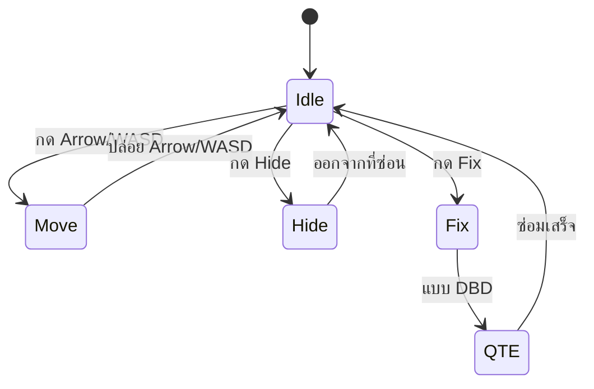

# Mechanic Design — [Pipe Repair]

## State Diagram

## Rules

| State | เข้าเงื่อนไข                        | ออกเงื่อนไข                                              | Note            |
| ----- | ----------------------------------------------- | ------------------------------------------------------------------- | --------------- |
| Idle  | เริ่มเกม / หยุดเคลื่อนที่ | กด input ใดๆ                                                   | Animation loop  |
| Move  | กดปุ่มทิศทาง                        | ปล่อยปุ่ม                                                  | Speed = slow    |
| Hide  | กด Hide                                       | โดนผลักออก / กดออกจากที่ซ่อน               | Have time limit |
| Fix   | กด Fix                                        | ซ่อมไม่สำเร็จหลายครั้ง / ซ่อมสำเร็จ | Have QTE        |
