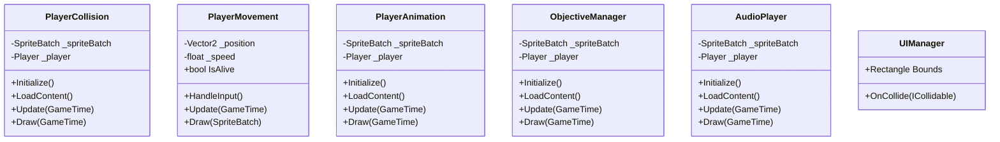

# Class Diagram — [Imaginophobia]

```mermaid
classDiagram
    class PlayerCollision {
        -SpriteBatch _spriteBatch
        -Player _player
        +Initialize()
        +LoadContent()
        +Update(GameTime)
        +Draw(GameTime)
    }
    class PlayerMovement {
        -Vector2 _position
        -float _speed
        +bool IsAlive
        +HandleInput()
        +Update(GameTime)
        +Draw(SpriteBatch)
    }
    class PlayerAnimation {
        -SpriteBatch _spriteBatch
        -Player _player
        +Initialize()
        +LoadContent()
        +Update(GameTime)
        +Draw(GameTime)
    }
    class ObjectiveManager {
        -SpriteBatch _spriteBatch
        -Player _player
        +Initialize()
        +LoadContent()
        +Update(GameTime)
        +Draw(GameTime)
    }

    class AudioPlayer {
        -SpriteBatch _spriteBatch
        -Player _player
        +Initialize()
        +LoadContent()
        +Update(GameTime)
        +Draw(GameTime)
    }
    class UIManager {
        +Rectangle Bounds
        +OnCollide(ICollidable)
    }
```
